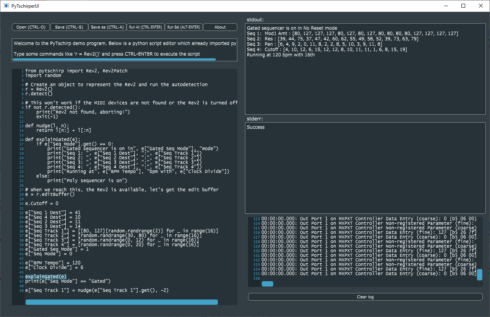

# Introduction

This is a simple UI program that allows you to easily explore the concept of the [pytschirp]() project. This project builds Python language bindings for MIDI-capable synthesizers, to allow you to program these synthesizers in, you guessed it, Python. *Real synthesizer programming*.

For the time being, currently only the [Sequential](https://www.sequential.com/) Prophet Rev2 synthesizer is supported, but many more synths are on their way.

If you acquire the software, this is what you will get:

Effectively it is a little code editor already preloaded with a python interpreter and pytschirp, so you can type into the edit window, execute the python by pressing CTRL-ENTER, and see the output, error messages, as well as the generated MIDI commands going back and forth between your computer and the synthesizer.

You can use it a little bit like a Jupyter Notebook by selecting text and then using ALT-ENTER to execute only the selection.

Live editing of synthesizers is possible.

# Example

Creating the synthesizer in Python is as easy as it gets with just three lines of code:

    import pytschirp
    r = pytschirp.Rev2()
    r.detect()

This will produce some MIDI messages in the lower right corner of the screen, and when everything is setup properly (the computer can talk to the Rev2), we are now ready for live editing the edit buffer of the synthesizer. For this, we will retrieve the edit buffer object:

    e = r.editBuffer()

which is now "alive" in that every modification we make in python to the edit buffer, MIDI commands will be sent immediately to the synth. 

So for example, if you want to set the cutoff parameter:

    e.Cutoff = 0

will set that value. Alternatively, you can get a textual print out of the whole edit buffer by doing a 

    print(e.toText())

Python is ideally suited to to complex things, for example randomize the track one of the gated sequencer in a specific value range by:

    e["Seq Track 1"] = [random.randrange(30, 80) for _ in range(16)]

you get the gist. There are some real-life examples in the aptly called `examples` directory, have a look at them.

Full documentation on the language bindings of pytschirp will be created inside the [pytschirp project](https://github.com/christofmuc/pytschirp), head over there for the in-depth infos. pytschirp can be used standalone from any python interpreter or even Jupyter notebook, the PyTschirper UI program is only a little tool that allows people to quickly explore the idea.

# Building the software

### Supported platforms

Tested currently only on Windows 10, but all technology used is cross platform and it should be possible to build on Linux and Mac OS, if you know what you are doing.

## Prerequisites

We use [CMake 3.14](https://cmake.org/) and Visual Studio 2017 for C++. Make sure to have both of these installed. Newer Visual Studios might work as well, you can select them as generators in CMake. We also require a [Python 3.6](https://www.python.org/downloads/release/python-360/) installation.

## Downloading

Clone with submodules from github

    git clone --recurse-submodules https://github.com/christofmuc/PyTschirper.git

The recursive clone with  submodules is required to retrieve the following additional modules already into the right spot inside the source tree:

1. We use the magnificent [JUCE library](https://juce.com/) to immensly reduce the amount of work we have to do. 
6. [juce-cmake](https://github.com/remymuller/juce-cmake) to allow us to use JUCE and CMake together.
3. [pybind11](https://pybind11.readthedocs.io/en/stable/) is the solution to use C++ code from within Python, as is done by the pytschirp project, as well as embedding Python into C++ code, which is what we do here in PyTschirper.
4. The configure step will download (on Windows) the allmighty [boost](https://www.boost.org/) library, sorry for the bloat but I simply had no time to remove the dependency yet. All my professional projects of course rely on boost, so it is a natural to incorporate it here as well.

## Building on Windows

Using CMake and building is a simple step if the prerequisites are fulfilled. Simply open a command line in the downloaded root directory `<PyTschirpDir>` and run

    cmake -S . -B builds -G "Visual Studio 15 2017 Win64"

This will generate a solution file for Visual Studio in the builds subdirctory. You can build the software to run it immediately with the command

    cmake --build builds --config Release

This will produce the executable in the path `builds\source\Release`, namely a file called `PyTschirper.exe` which you can double click and launch.

## Licensing

As some substantial work has gone into the development of this, I decided to offer a dual license - AGPL, see the LICENSE.md file for the details, for everybody interested in how this works and willing to spend some time her- or himself on this, and a commercial MIT license available from me on request. Thus I can help the OpenSource community without blocking possible commercial applications.

## Contributing

All pull requests and issues welcome, I will try to get back to you as soon as I can. Due to the dual licensing please be aware that I will need to request transfer of copyright on accepting a PR. 

## About the author

Christof is a lifelong software developer having worked in various industries, and can't stop his programming hobby anyway. 
